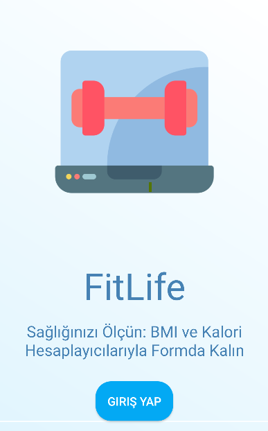
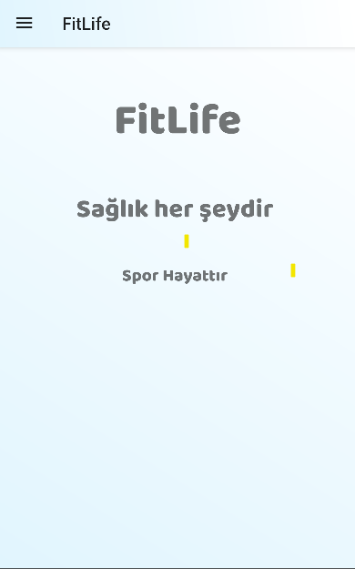
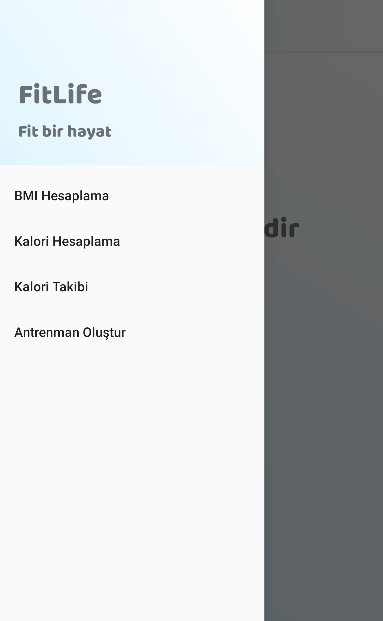
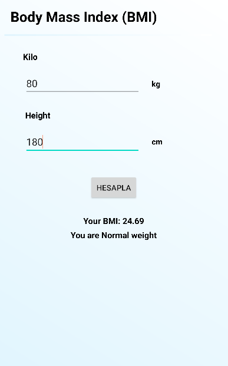
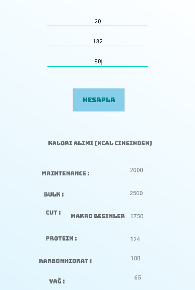
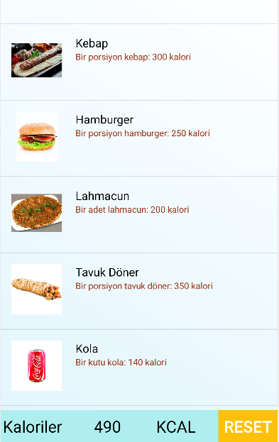
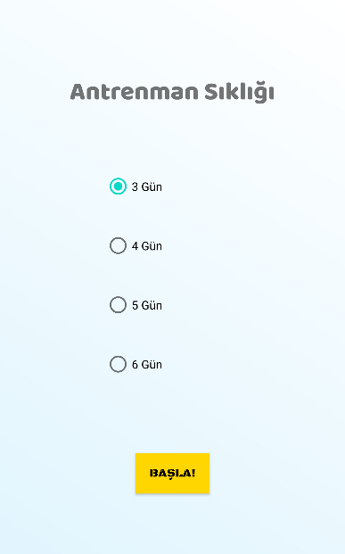
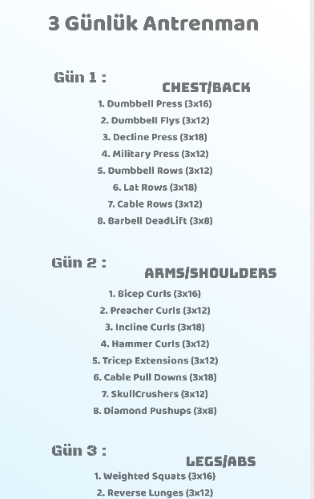

# FitLife Fitness Uygulaması

FitLife, sağlıklı bir yaşam tarzı sürdürmenize yardımcı olmak için tasarlanmış kapsamlı bir fitness uygulamasıdır. Bu uygulama, vücut kitle indeksinizi (BMI) hesaplamanıza, kalori alımınızı takip etmenize ve kişiselleştirilmiş antrenman programları oluşturmanıza olanak sağlar.

## Özellikler

- **BMI Hesaplama**: FitLife, boy ve kilo bilgilerinizi kullanarak vücut kitle indeksinizi (BMI) hesaplar .

- **Kalori Takibi**: FitLife, kullanıcının tüketilen besinlerin kalori değerlerini görüntülemesine olanak sağlar. Kullanıcılar günlük alması gereken protein, yağ ve karbonhidrat miktarları hakkında bilgi alabilir. Bu sayede sağlıklı bir diyet ve beslenme programı oluşturmak için gerekli bilgileri elde edebilirler.

- **Kişiselleştirilmiş Antrenman Programları**: FitLife, hedeflerinize uygun olarak kişiselleştirilmiş antrenman programları sunar. İstediğiniz seviye ve hedeflere göre antrenman planınızı oluşturabilir ve takip edebilirsiniz.

## Ekran Görüntüleri

### Giriş Ekranı

### Ana Sayfa

### Menü

### BMI Hesaplama

### Kalori Hesabı

### Besin kalori takibi

### İhtiyaca göre Antrenman Programları 

### 3 Günlük Antrenman Programı

               

